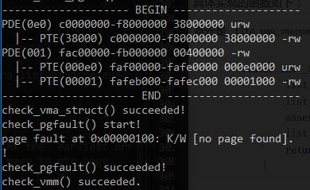

# OS Lab3 Report

苏克
2014011402

## 知识点

本次实验主要涉及虚存管理。其中练习1是当页异常发生时，若异常产生的原因是所访问的虚拟地址没有对应到物理地址，则我们为他分配一个物理页。练习2实现了简单的FIFO页面替换算法，实际上只要填充维护fifo队列（这里用链表实现）的过程即可。因此这次的练习内容也较为简单。

值得注意的是，练习指引中两次出现“在LAB2 EXERCISE[12] 处填写代码”，这应该是写错了，应该是lab3……

## 练习0

和之前一样，通过meld将lab1和2的代码复制过来。主要涉及的文件也不多，应该只有trap/trap.c，mm/default_pmm.c，mm/pmm.c这三个。

## 练习1

### 思路

本练习要求我们完成do_pgfault函数，给未映射到物理地址的虚地址映射物理页。根据注释的指引，我们需要先试图get_pte（注释亲切地告诉我们，第三个参数应该置为1，即true。这个参数就是create，我们在lab2中判断此参数为真时才会为不存在pte的情况新建pte），然后判断是否存在物理地址。如果不存在，通过pgdir_alloc_page来映射物理地址，其第三个参数的值perm已经为我们写好了，实际上就是参考VMA的权限来设置所映射物理页的权限。

如果物理页面存在，则（根据注释的指引），我们先调用swap_in函数，依据mm和addr的值换入物理页。之后，调用page_insert函数根据mm，addr和page建立物理地址和虚拟地址的映射。最后我们将这一页面设置为可换，做法是调用swap_map_swappable函数。注意在换入页之后，需要将page的pra_vaddr参数置为addr，即所联系的虚地址。之后在swap_out该页的时候，会读取换出页面的pra_vaddr虚地址，然后用这个虚地址才能索引到页面对应的PTE（过程在swap.c文件中）。

### 实现

具体的实现如下：

```c
#if 1
    /*LAB3 EXERCISE 1: 2014011402*/
    ptep = get_pte(mm->pgdir, addr, 1);              //(1) try to find a pte, if pte's PT(Page Table) isn't existed, then create a PT.
    if (*ptep == 0) {
                            //(2) if the phy addr isn't exist, then alloc a page & map the phy addr with logical addr
        pgdir_alloc_page(mm->pgdir, addr, perm);

    }
    else {
    /*LAB3 EXERCISE 2: 2014011402
    	略去中间的提示注释
    */
        if(swap_init_ok) {
            struct Page *page=NULL;

            swap_in(mm, addr, &page);
            page->pra_vaddr = addr;
                                    //(1）According to the mm AND addr, try to load the content of right disk page

                                    //    into the memory which page managed.

            page_insert(mm->pgdir, page, addr, perm);
                                    //(2) According to the mm, addr AND page, setup the map of phy addr <---> logical addr

            swap_map_swappable(mm, addr, page, 1);
                                    //(3) make the page swappable.
        }
        else {
            cprintf("no swap_init_ok but ptep is %x, failed\n",*ptep);
            goto failed;
        }
   }
#endif
```

### 运行结果截图



### 注：与答案的不同

另外值得一提的是，答案代码几乎每一步操作都进行了结果合法性的判断，如果失败就会通过ret向中断处理器传回错误信息，具有很强的鲁棒性，这里我确实做的不够细致。但是在不出错的情况（也是我们绝大多数时候所期望看到并的确看到的情况）下，两者没有差别。


## 练习2

### 思路和实现

练习2要求我们补全FIFO页面替换算法。我们其实只要实现维护FIFO队列的过程即可。

这里队列是用链表实现的，链表项是Page的pra_page_link属性。在_fifo_map_swappable函数中，我们需要将一个新到的页面放在队尾。在我们的链表实现中，用链表的头代表队尾，因此实现非常简单，如下：

```c
static int
_fifo_map_swappable(struct mm_struct *mm, uintptr_t addr, struct Page *page, int swap_in)
{
    list_entry_t *head=(list_entry_t*) mm->sm_priv;
    list_entry_t *entry=&(page->pra_page_link);
 
    assert(entry != NULL && head != NULL);
    //record the page access situlation
    /*LAB3 EXERCISE 2: 2014011402*/ 
    //(1)link the most recent arrival page at the back of the pra_list_head qeueue.
    list_add(head, entry);
    return 0;
}
```

而在_fifo_swap_out_victim函数中，我们需要将队首页面删去，并且将所删去的页面保存在ptr_page指针中。在swap.c的swap_out函数中，我们看到这样做的意义是将所删去页面传递给上层（其实是某种基类）函数，使得他可以读取所删去页面的pra_vaddr，并亲自完成删去页面的工作。我们只要实现“知道该删谁”的功能就可以了。

对于我们的链表来说，由于头尾是相连的，head->prev其实也就是链表的尾，同时也是队列的头，这个页面就是我们要删去的页面，但我们不必删去只要让其出队并将页面转交给上层即可。实现如下：

```c
static int
_fifo_swap_out_victim(struct mm_struct *mm, struct Page ** ptr_page, int in_tick)
{
     list_entry_t *head=(list_entry_t*) mm->sm_priv;
         assert(head != NULL);
     assert(in_tick==0);
     /* Select the victim */
     /*LAB3 EXERCISE 2: 2014011402*/ 
     list_entry_t *first_page_le_p = head->prev; // head: oldest. head->prev: the last element of the list, which is the one who first came in.
     struct Page* first_page_p = le2page(first_page_le_p, pra_page_link);
     list_del(first_page_le_p);
     //(1)  unlink the  earliest arrival page in front of pra_list_head queue

     *ptr_page = first_page_p;
     //(2)  set the addr of addr of this page to ptr_page

     return 0;
}
```

所用到的le2page宏和lab2中相同，只是第二个参数有区别。

### 运行截图


## 总结

完成本次实验后，我对虚拟页-物理页的映射关系加深了理解。通过维护队列来实现FIFO页面替换算法，并研究check函数中的测试样例，使得我更熟悉FIFO替换算法。

感谢助教老师的辛勤工作。

