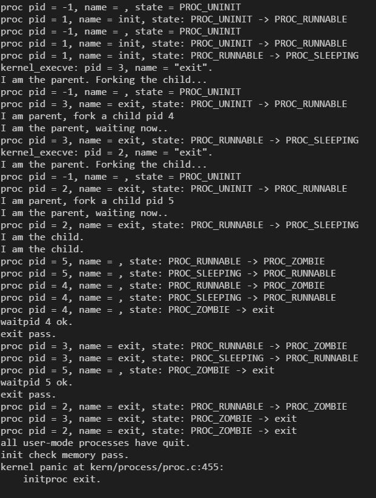

# OS Homework lec14&15

苏克

2014011402

计45

## 知识点

- 用户进程的启动、运行、就绪、等待、退出

启动：调用do_fork函数建立内核控制块，用户栈，页表等，然后调用wakeup_proc唤醒，即由UNINIT状态转入RUNNABLE状态。

运行：由proc_run填入合理的esp0和cr3内容，调用switch_to汇编函数，切换至此进程运行。

就绪：等待cpu调度。

等待：调用do_wait，进程进入SLEEPING状态。当子进程运行完毕成为僵尸进程之后，要将子进程杀掉。

退出：调用do_exit，将cr3修改，并释放MM内存空间。

- 用户进程的管理与简单调度
shedule函数负责调度进程，当前进程时间片用尽或不再运行时选择将运行的下一个进程。

- 用户进程的上下文切换过程
进程调度之后，proc_run函数将会修改合理的esp0和cr3，switch_to汇编函数将会恢复寄存器，使得新进程可以运行。

- 用户进程的特权级切换过程
用户进程运行时如碰到中断或异常，将执行系统调用，从而切换至内核态。系统调用返回时再由内核态回到用户态。

- 用户进程的创建过程并完成资源占用
do_fork函数将会调用proc_init进行进程的初始化，

- 用户进程的退出过程并完成资源回收
退出时调用do_exit函数修改cr3并释放内存空间，进程成为ZOMBIE状态，等待父进程将其释放。

## 程序执行情况

如图所示，展示了两个用户进程和相关内核进程的的整个生命周期。

